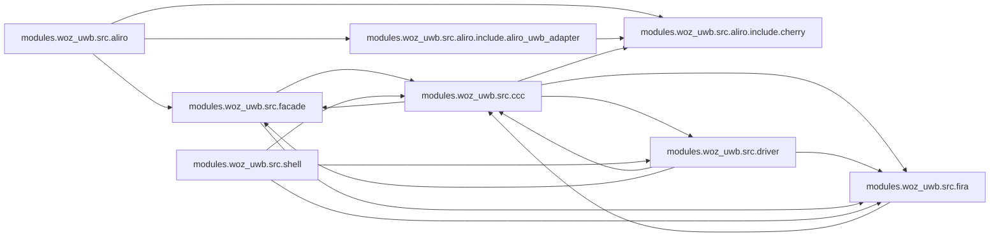

<!-- generated by `documate docs` — edit the source, not this file -->
# openaliro

**54 subsystems in 11 directories · 393/415 symbols documented (94%)**

**Start here:** [`modules/woz_uwb/src/aliro/aliro_uwb_msg.c`](architecture/modules.woz_uwb.src.aliro/aliro_uwb_msg.c.md), [`modules/woz_uwb/src/aliro/aliro_uwb_session.c`](architecture/modules.woz_uwb.src.aliro/aliro_uwb_session.c.md), [`modules/woz_uwb/src/aliro/aliro_uwb_adapter.c`](architecture/modules.woz_uwb.src.aliro/aliro_uwb_adapter.c.md) — the doors into the codebase (nothing else imports them).

## Directories

| directory | subsystems | documented |
|---|---|---|
| [`./`](architecture/root/README.md) | 2 | 12/12 (100%) |
| [`modules/woz_aliro_ecp/src/`](architecture/modules.woz_aliro_ecp.src/README.md) | 1 | 5/5 (100%) |
| [`modules/woz_uwb/src/aliro/`](architecture/modules.woz_uwb.src.aliro/README.md) | 10 | 103/118 (87%) |
| [`modules/woz_uwb/src/aliro/include/aliro_uwb_adapter/`](architecture/modules.woz_uwb.src.aliro.include.aliro_uwb_adapter/README.md) | 2 | 17/17 (100%) |
| [`modules/woz_uwb/src/aliro/include/cherry/`](architecture/modules.woz_uwb.src.aliro.include.cherry/README.md) | 4 | 36/36 (100%) |
| [`modules/woz_uwb/src/ccc/`](architecture/modules.woz_uwb.src.ccc/README.md) | 16 | 134/139 (96%) |
| [`modules/woz_uwb/src/driver/`](architecture/modules.woz_uwb.src.driver/README.md) | 7 | 43/43 (100%) |
| [`modules/woz_uwb/src/facade/`](architecture/modules.woz_uwb.src.facade/README.md) | 7 | 24/24 (100%) |
| [`modules/woz_uwb/src/fira/`](architecture/modules.woz_uwb.src.fira/README.md) | 3 | 7/7 (100%) |
| [`modules/woz_uwb/src/shell/`](architecture/modules.woz_uwb.src.shell/README.md) | 1 | 12/12 (100%) |
| [`ports/esp32s3/sample/src/`](architecture/ports.esp32s3.sample.src/README.md) | 1 | 0/2 (0%) |
